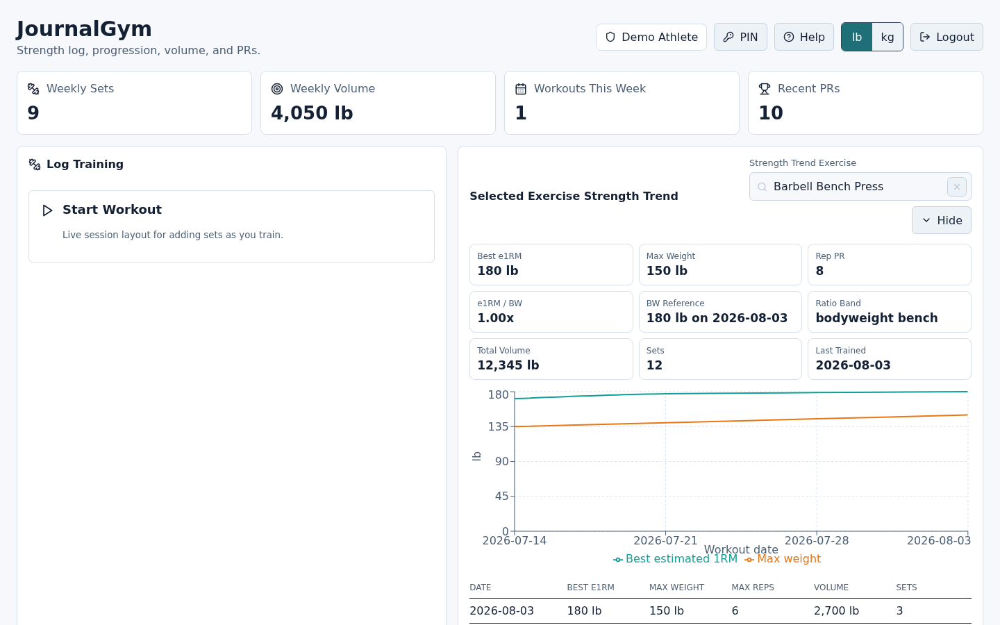
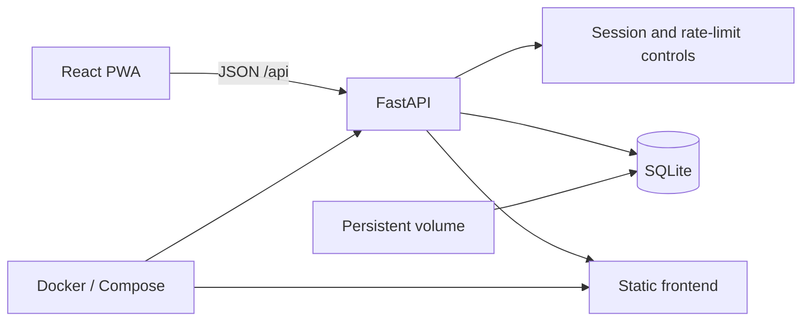

# JournalGym

[](https://github.com/KyleHafner/journalgym-app/actions/workflows/ci.yml)

A self-hosted strength-training journal built for fast workout entry, useful progression analysis, and user-owned data.



_Dashboard shown with synthetic demonstration data._

JournalGym combines a FastAPI/SQLite backend with a React frontend. It supports multiple users, structured workout logging, progression charts, templates, body measurements, goals, exports, and an installable mobile-friendly PWA.

## Why I built it

Most lifting trackers either hide useful history behind subscriptions or optimize for a fixed training methodology. JournalGym keeps the data local and makes the common loop—choose an exercise, enter sets, resume a draft, and review progress—work without requiring a cloud account.

## Highlights

### Workout logging

- External-load, bodyweight, added-weight, and assisted-weight sets
- Bulk notation such as `3x8 @135`
- Autosaved drafts, templates, copied sessions, and undoable deletion
- Unit-aware plate calculator, rest timer, and lb/kg conversion
- Exercise aliases, form notes, muscle taxonomy, and searchable history

### Progress and ownership

- Estimated 1RM, volume, personal records, weekly consistency, and muscle-volume views
- Bodyweight and measurement history with bodyweight-relative strength context
- User goals with target dates
- JSON backup/import and CSV set export
- Local SQLite storage with documented backup and restore procedures

### Application engineering

- Multi-user setup, PIN authentication, revocable sessions, and last-admin protection
- Login throttling, bounded request bodies, validation limits, security headers, and trusted-proxy handling
- Named SQLite migrations and foreign-key protection
- Brief dashboard caching with write invalidation
- Docker multi-stage build, non-root runtime user, health check, and log rotation
- Backend, migration, authentication, proxy, security, workout, parser, and draft regression tests

## Architecture



The frontend is compiled in the first Docker build stage. The final Python image serves both the API and built static assets as a non-root user. Runtime data lives in a mounted volume rather than the image.

## Quick start

Requirements: Docker with Compose support.

```bash
git clone https://github.com/KyleHafner/journalgym-app.git
cd journalgym-app
cp .env.example .env
mkdir -p data
sudo chown -R 10001:10001 data
docker compose up --build
```

Open `http://127.0.0.1:8092` and create the first administrator account.

The default deployment binds only to loopback. If you publish it through HTTPS, configure your reverse proxy, set `FITNESS_COOKIE_SECURE=true`, and define only the proxy addresses that should be trusted.

## Local development

### Backend

```bash
python -m venv .venv
. .venv/bin/activate
pip install --require-hashes -r requirements.lock
python -m unittest discover -s tests
python -c "import api.main"
uvicorn api.main:app --reload --port 8092
```

### Frontend

```bash
cd frontend
npm ci
npm run test:drafts
npm run test:bulk
npm run dev
```

The Vite development server proxies `/api` to `http://127.0.0.1:8092`.

## Configuration

The checked-in `.env.example` contains safe local defaults. Important settings include:

- `FITNESS_DB_PATH` — SQLite database path inside the container
- `FITNESS_CONFIG_DIR` — host directory mounted for persistent state
- `FITNESS_COOKIE_SECURE` — enable only when HTTPS is in front of the app
- `FITNESS_CORS_ALLOW_ORIGINS` — optional explicit browser origins
- `UVICORN_FORWARDED_ALLOW_IPS` — peers permitted to supply proxy headers

Additional limits and security settings are documented alongside their defaults in `api/main.py`.

## Backups

Use SQLite's online backup command rather than copying a live database blindly:

```bash
sqlite3 data/fitness.db ".backup 'data/fitness-backup.db'"
```

Keep a known-good copy outside the application host. Verify a restore in an isolated directory before relying on it.

## Public-edition note

The deployed instance and its operational history remain private. This repository is a clean public edition of the application source: production addresses, user data, credentials, deployment paths, and private infrastructure documentation are deliberately excluded.

## License

MIT
